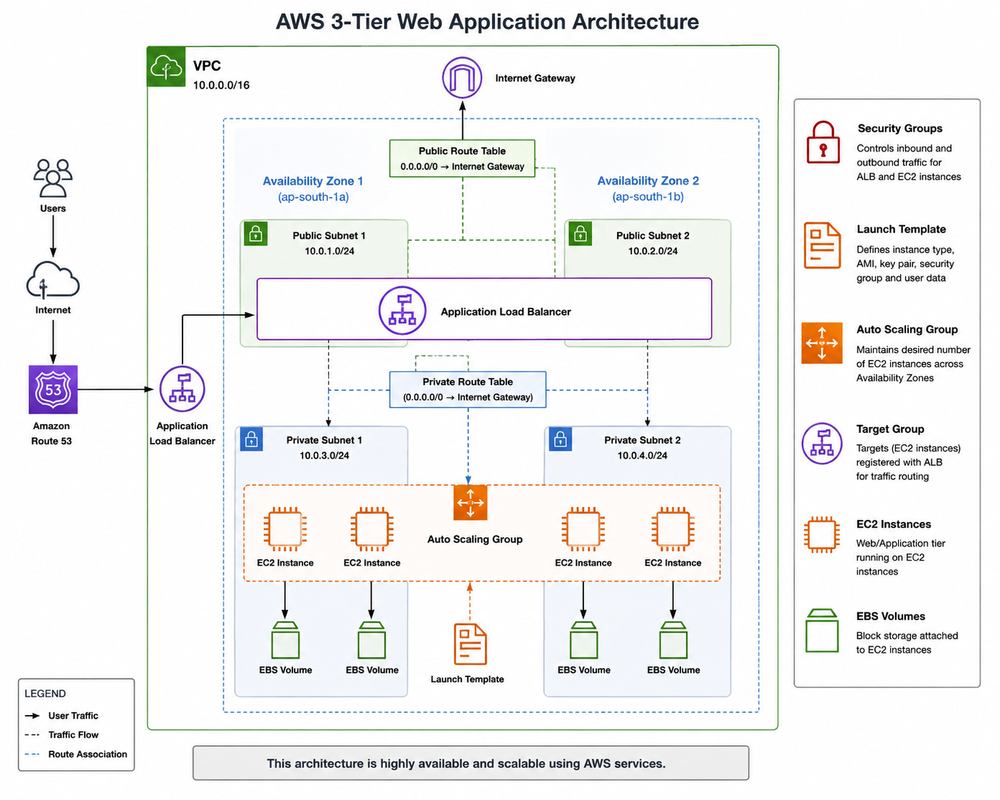

# AWS 3-Tier Web Application

## 📌 Project Overview

This project demonstrates the deployment of a scalable and highly available web application architecture on AWS.

The infrastructure is designed using Amazon VPC, multiple subnets, Internet Gateway, Route Tables, Security Groups, Application Load Balancer, Target Groups, EC2 instances, Launch Templates, and Auto Scaling.

---

## 🏗️ Architecture



---

## ☁️ AWS Services Used

- Amazon VPC
- Subnets
- Internet Gateway
- Route Tables
- Security Groups
- Amazon EC2
- Amazon EBS
- Application Load Balancer (ALB)
- Target Groups
- Auto Scaling Group
- Launch Template

---

## 🔄 Architecture Flow

```text
Internet
   |
   v
Application Load Balancer
   |
   v
Target Group
   |
   v
EC2 Instances
   |
   v
EBS Storage

Auto Scaling manages the EC2 instances
using the Launch Template.